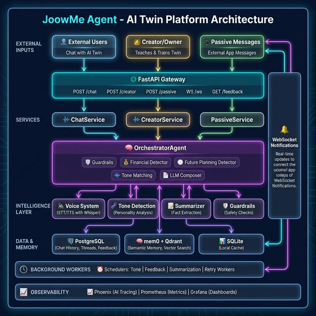

# JoowMe Agent — AI Twin with Tone-Aware Memory

**JoowMe Agent** is an intelligent AI Twin platform that mimics the communication style of a real person. It uses a **three-layer memory architecture** to understand and replicate how a person speaks differently with various people and groups.

## 🧠 Memory Architecture

The system extracts and stores personality data across three distinct layers:

| Layer | Description | Example |
|-------|-------------|---------|
| **Core Facts** | Extracts and stores factual information about the user — preferences, habits, biographical details | "Ali prefers tea over coffee" |
| **Cluster Personas** | Captures the tone and style a person uses with **groups** of people (friends, family, colleagues, boss, etc.) | Formal with colleagues, casual with friends |
| **Dyadic Overrides** | Captures the **unique tone** between two specific individuals — overriding the cluster-level defaults | Person A is more humorous with Person B than with other friends |

This layered approach allows the AI Twin to generate responses that feel natural and personalized for each conversation partner.

## 📐 Architecture



## 🚀 Getting Started

### Prerequisites

- **Python 3.10+**
- **Docker & Docker Compose**
- **An OpenAI-compatible API key** (e.g., OpenRouter, OpenAI)

### 1. Configure Environment Variables

Copy the example environment file and edit it with your credentials:

```bash
cp .env.example .env
```

Open `.env` and update the following values:

```env
# Database credentials
POSTGRES_USER=your_db_username
POSTGRES_PASSWORD=your_db_password

# LLM API Key
OPENAI_API_KEY=your-api-key-here
```

Also update `docker-compose.yaml` to match your database credentials:

```yaml
environment:
  POSTGRES_USER: your_db_username
  POSTGRES_PASSWORD: your_db_password
```

> ⚠️ **Important:** Never commit real credentials to version control. The `.env` file is already in `.gitignore`.

### 2. Create a Virtual Environment & Install Dependencies

```bash
python -m venv venv
source venv/bin/activate
pip install -r requirements.txt
```

### 3. Start Infrastructure Services

Launch PostgreSQL, Redis, Qdrant, and monitoring stack:

```bash
sudo docker compose up -d
```

### 4. Initialize the Database

Run the migration script to create all required tables:

```bash
python scripts/init_databases.py
```

### 5. Start the API Server

```bash
uvicorn main:app --host 0.0.0.0 --port 8000
```

The API will be available at `http://localhost:8000`. You can view the interactive docs at `http://localhost:8000/docs`.

### 6. Launch the Streamlit UI

In a separate terminal (with the virtual environment activated):

```bash
streamlit run ./streamlit_ui/app.py
```

The UI will be available at `http://localhost:8501`.

## 📁 Project Structure

```
joowme-agent/
├── api/                    # FastAPI routers and endpoints
├── config/                 # Settings and dependency injection
├── db/                     # PostgreSQL, Qdrant, and Redis data layers
├── guardrail/              # Safety and relevance checks
├── memory/                 # Three-layer memory (facts, clusters, dyadic)
├── orchestrator/           # Main conversation orchestration
├── service/                # Business logic services
├── streamlit_ui/           # Streamlit dashboard
├── observability/          # Prometheus metrics and Grafana dashboards
├── scripts/                # Database migrations and utilities
├── tests/                  # Unit tests
├── main.py                 # Application entry point
├── docker-compose.yaml     # Infrastructure services
└── requirements.txt        # Python dependencies
```

## 🧪 Running Tests

```bash
source venv/bin/activate
python -m pytest tests/ -v
```

## 📖 Documentation

- [API Reference](mdfiles/API.md)
- [Architecture Details](mdfiles/ARCHITECTURE.md)
- [Setup Guide](mdfiles/SETUP.md)
- [مستندات فارسی](mdfiles/ARCHITECTURE.fa.md)
