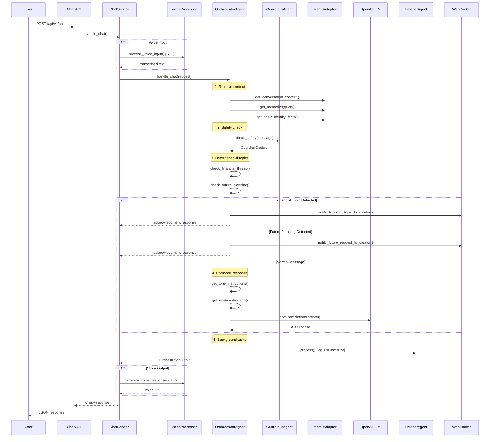

# JoowMe Agent — Architecture & How It Works

## Overview

**JoowMe Agent** (internally named **PetaProcTwin**) is an **AI Twin** platform. It creates a digital replica of a real person (the "Creator") that can automatically chat with the creator's contacts, mimicking their tone, personality, and knowledge. The platform learns from the creator's conversations, detects relationships, remembers facts, and handles sensitive topics (financial, future planning) by routing them to the real person.

### Core Concept

```
┌──────────────────────┐       ┌───────────────────────────┐       ┌──────────────────────┐
│   External Users     │──────▶│      AI Twin (Agent)      │◀──────│   Creator (Owner)    │
│   (Friends, Family,  │       │                           │       │                      │
│    Colleagues, etc.) │◀──────│  Learns tone, facts,      │──────▶│  Teaches, corrects,  │
│                      │       │  relationship context     │       │  responds to special │
└──────────────────────┘       └───────────────────────────┘       │  topics              │
                                                                    └──────────────────────┘
```

- **External users** chat with the AI Twin thinking they're chatting with the real person.
- **The Creator** trains the twin by chatting with it and responding to special topics (financial, future plans).
- **The AI Twin** learns the creator's personality, tone, facts, and relationships over time.

---

## Technology Stack

| Layer              | Technology                                                |
|--------------------|-----------------------------------------------------------|
| **Web Framework**  | FastAPI (async, Python)                                   |
| **LLM**           | OpenAI API (GPT-4o, GPT-4o-mini, configurable per agent)   |
| **Memory**         | [mem0](https://github.com/mem0ai/mem0) (semantic memory)  |
| **Vector Database**| Qdrant (similarity search)                                |
| **Relational DB**  | PostgreSQL 16 (chat history, feedback, threads)           |
| **Local DB**       | SQLite (mem0 history cache)                               |
| **Embeddings**     | BAAI/bge-m3 (local) or OpenAI embeddings                 |
| **Voice STT**      | OpenAI Whisper API                                        |
| **Voice TTS**      | OpenAI TTS API                                            |
| **DI Container**   | dependency-injector                                       |
| **Observability**  | Phoenix (AI tracing), Prometheus, Grafana                 |
| **Real-time**      | WebSocket (FastAPI native)                                |
| **UI**             | Streamlit (admin/creator dashboard)                       |
| **Containerization**| Docker Compose                                           |

---

## Project Structure

```
joowme-agent/
├── main.py                          # FastAPI app entry point & lifespan
├── config/
│   ├── settings.py                  # Pydantic settings (env vars)
│   └── container.py                 # DI container (dependency-injector)
├── api/
│   └── routers/
│       ├── chat.py                  # POST /api/v1/chat
│       ├── creator.py               # POST /api/v1/creator
│       ├── passive.py               # POST /api/v1/passive
│       ├── passive_last_message_id.py # GET /api/v1/passive/last-msgId
│       ├── feedback.py              # Feedback, future requests, financial threads
│       ├── scheduler.py             # Admin scheduler endpoints
│       ├── websocket_notifications.py # WebSocket real-time notifications
│       └── voice_static.py          # Voice file serving
├── orchestrator/
│   ├── orchestrator_agent.py        # Central brain: response composition
│   ├── messages.py                  # Pydantic request/response models
│   ├── financial_topic_detector.py  # LLM-based financial topic detection
│   └── future_planning_detector.py  # LLM-based future plan detection
├── service/
│   ├── chat_service.py              # Chat business logic + voice I/O
│   ├── creator_service.py           # Creator business logic + voice I/O
│   ├── passive_service.py           # Passive observation recording
│   ├── relationship_feedback_service.py # Relationship questions & feedback
│   └── voice/
│       ├── voice_processor.py       # Voice I/O coordinator
│       ├── openai_stt.py            # Speech-to-Text (Whisper)
│       ├── openai_tts.py            # Text-to-Speech
│       └── voice_storage.py         # Voice file storage management
├── memory/
│   ├── mem0_adapter.py              # mem0 integration (add/get/search memories)
│   ├── attribute_schema.py          # Memory attribute schemas
│   └── mem_custom_prompt.py         # Custom mem0 extraction prompts
├── listener/
│   └── listener.py                  # Message logging & summarization trigger
├── guardrail/
│   └── guardrails_agent.py          # Safety checks, jailbreak detection
├── summarizer/
│   ├── summarizer_agent.py          # LLM-based conversation summarization
│   ├── core_fact_extractor.py       # Structured fact extraction from text
│   └── passive_summarizer_agent.py  # Passive observation summarization
├── tone_and_personality_traits_detection/
│   ├── tone_detection_agent.py      # LLM-based tone/personality analysis
│   └── utils.py                     # Tone analysis utilities
├── scheduler/
│   ├── tone_scheduler.py            # Periodic tone analysis
│   ├── tone_retry_worker.py         # Retry failed tone analyses
│   ├── feedback_scheduler.py        # Periodic relationship question generation
│   ├── retry_worker.py              # Retry failed summarizations
│   ├── passive_scheduler.py         # Passive data scheduling
│   ├── passive_summarization_scheduler.py # Passive summarization scheduling
│   └── passive_summarization_retry_worker.py # Retry passive summarizations (not present as separate file, integrated)
├── db/
│   ├── postgres.py                  # Async engine/session factories
│   ├── postgres_chat_store.py       # Chat event log (PostgreSQL)
│   ├── postgres_relationship_cluster_personas.py # Relationship clusters
│   ├── postgres_dyadic_overrides.py # Per-pair tone overrides
│   ├── postgres_financial_threads.py # Financial thread management
│   ├── postgres_future_requests.py  # Future planning request storage
│   ├── passive_storage.py           # Passive observation state
│   ├── passive_archive_storage.py   # Archived passive observations
│   ├── passive_summarization_storage.py # Passive summarization state
│   ├── creator_chat_store.py        # Creator chat storage
│   ├── tone_retry_storage.py        # Tone retry queue
│   ├── qdrant.py                    # Qdrant client config
│   └── shared_pool.py              # Shared connection pool
├── observability/
│   ├── phoenix_setup.py             # OpenTelemetry + Phoenix tracing
│   ├── metrics.py                   # Prometheus metrics
│   ├── sqlite_metrics.py            # SQLite metrics collector
│   └── docker/                      # Prometheus/Grafana configs
├── streamlit_ui/
│   ├── app.py                       # Streamlit app entry
│   └── pages.py                     # Dashboard pages
├── scripts/
│   ├── init_databases.py            # Database initialization
│   ├── migrations.py                # Schema migrations
│   └── load_embedding_model.py      # Embedding model loader
├── docker-compose.yaml              # Qdrant, PostgreSQL, Phoenix, Prometheus, Grafana
└── requirements.txt                 # Python dependencies
```

---

## How It Works — Processing Flow

### 1. Chat Flow (User → AI Twin)



### 2. Creator Flow (Owner → Twin)

The creator (twin owner) chats with their own twin to teach it about themselves.

1. **Input processing** — same voice I/O pipeline
2. **Memory retrieval** — fetches creator-specific memories
3. **Response composition** — uses creator-specific LLM instructions that encourage learning
4. **Background learning** — extracts facts from the conversation and stores them in memory via mem0

### 3. Passive Observation Flow

The system passively records messages that the twin's owner has with others in external messaging apps.

1. **Batch ingestion** — receives batches of messages via `POST /api/v1/passive`
2. **Voice processing** — transcribes any voice messages
3. **Storage** — stores in PostgreSQL `passive_observations` table
4. **Last message tracking** — tracks the latest synced message ID for incremental sync
5. **Background summarization** — periodically summarizes accumulated passive messages

---

## Key Components

### OrchestratorAgent (The Brain)

The central orchestrator handles all chat logic. It:

- **Retrieves context**: conversation summary, memories, identity facts, chat history
- **Manages stranger detection**: identifies if a user is unknown and handles introductions
- **Detects wrong names**: if someone addresses the twin by the wrong name
- **Detects financial topics**: routes investment, crypto, and money questions to the real owner
- **Detects future planning**: routes scheduling/meeting requests to the real owner
- **Delivers creator responses**: when the creator responds to financial/planning requests, delivers them in the next chat
- **Applies tone matching**: uses detected tone profiles and relationship context
- **Composes responses**: uses OpenAI LLM with rich system prompts including personality, facts, tone, and time-awareness

### Memory System (mem0 + Qdrant)

- **Semantic memory** via mem0 with Qdrant vector store
- **Memory types**: user messages, summaries, creator thoughts, basic identity facts
- **Custom extraction prompts** for Persian/English bilingual content
- **Profile snapshots** for quick identity retrieval
- **BAAI/bge-m3 embeddings** (runs locally or falls back to online)

### Guardrails

- **Whitelist patterns** — greetings, short responses bypass LLM check
- **Blocklist patterns** — jailbreak attempts, data extraction blocked immediately
- **Self-query detection** — when users ask about themselves, routes to profile-aware response
- **LLM safety check** — for ambiguous messages, uses LLM to classify relevance

### Tone Detection

- **Analyzes conversations** between pairs of users
- **Generates per-user tone profiles**: formality, humor, emoji usage, warmth, emotional dependence
- **Detects relationship class**: spouse, family, boss, subordinate, colleague, friend, stranger
- **Updates dynamically** via scheduled background analysis

### Summarization

- **Per-conversation summaries** using LLM (with support for incremental/rolling summaries)
- **Fact extraction** — identifies high/medium/low priority facts (identity, occupation, family, preferences)
- **Passive summarization** — processes passively observed conversations in background

### Schedulers (Background Workers)

| Scheduler                           | Purpose                                                  |
|-------------------------------------|----------------------------------------------------------|
| **ToneScheduler**                   | Periodically analyzes conversation pairs for tone/personality |
| **ToneRetryWorker**                 | Retries failed tone analyses                              |
| **FeedbackScheduler**               | Generates relationship classification questions           |
| **RetryWorker**                     | Retries failed summarizations                             |
| **PassiveSummarizationScheduler**   | Summarizes passively observed conversations               |
| **PassiveSummarizationRetryWorker** | Retries failed passive summarizations                     |

### Real-time Notifications (WebSocket)

- Maintains per-user WebSocket connections
- Notifies creators about: new financial topics, new future-planning requests, financial thread messages, delivered responses
- Includes 30-second heartbeat ping

### Voice System

- **STT**: OpenAI Whisper API — transcribes user voice messages
- **TTS**: OpenAI TTS API — generates voice responses
- **Storage**: Saves voice files to disk, serves via `/voices/` endpoint
- **Bidirectional**: Both input and output can be voice

### Observability Stack

| Component       | Purpose                                           | Port  |
|-----------------|---------------------------------------------------|-------|
| **Phoenix**     | AI/LLM trace visualization (OpenTelemetry)         | 6006  |
| **Prometheus**  | Metrics collection (HTTP, LLM, scheduling)          | 9091  |
| **Grafana**     | Metrics dashboards and alerting ⚠️ **(WIP — not yet complete)** | 3000  |
| **PostgreSQL Exporter** | PostgreSQL metrics for Prometheus           | 9187  |

> ⚠️ **Note:** Grafana dashboards are still a work in progress. The infrastructure is provisioned and running, but custom dashboards and alerting rules have not been fully configured yet.

---

## Infrastructure (Docker Compose)

The `docker-compose.yaml` brings up:

1. **Qdrant** — vector database for semantic memory search
2. **PostgreSQL 16** — relational database for chat history, feedback, threads
3. **PostgreSQL Exporter** — exposes PG metrics to Prometheus
4. **Phoenix** — AI observability with OTLP receiver
5. **Prometheus** — metrics scraping and storage
6. **Grafana** — dashboards (auto-provisioned datasources & dashboards) ⚠️ **WIP**
7. **SQLite Helper** — ensures permissions on local SQLite data

---

## Configuration

All configuration via environment variables (`.env` file), managed by Pydantic `Settings`:

| Category           | Key Variables                                                          |
|--------------------|------------------------------------------------------------------------|
| **Database**       | `POSTGRES_HOST`, `POSTGRES_PORT`, `POSTGRES_DB`, `POSTGRES_USER`, `POSTGRES_PASSWORD` |
| **Vector DB**      | `QDRANT_URL`                                                           |
| **LLM Models**     | `COMPOSER_MODEL`, `CREATOR_MODEL`, `GUARDRAIL_MODEL`, `SUMMARIZER_MODEL`, `TONE_MODEL`, `FACT_EXTRACTOR_MODEL` |
| **LLM Temps**      | `COMPOSER_TEMPERATURE`, `CREATOR_TEMPERATURE`, etc.                    |
| **Memory**         | `MEM0_LLM_MODEL`, `MEM0_EMBEDDING_MODEL`                              |
| **Voice**          | `VOICE_ENABLED`, `VOICE_STT_MODEL`, `VOICE_TTS_MODEL`, `VOICE_STORAGE_PATH` |
| **Scheduling**     | `TONE_SCHEDULER_INTERVAL`, `FEEDBACK_SCHEDULER_INTERVAL`, etc.         |
| **OpenAI**         | `OPENAI_API_KEY`, `OPENAI_BASE_URL`                                    |

---

## Messenger Integration — Twin Mode

This application is designed to be integrated into a **messaging platform**. When deployed inside a messenger, the user needs a **Twin Mode** toggle that allows switching between:

- **🟢 Twin Mode ON** — The AI Twin automatically responds to incoming messages on behalf of the user. Messages are processed through the chat API, and the twin generates responses using the user's learned personality, tone, and knowledge.
- **🔴 Twin Mode OFF** — Normal messaging mode. The user reads and responds to messages themselves. Messages can still be recorded via the Passive API for learning purposes.

### Tone-Aware Responses

A key feature of this system is **automatic tone detection**. The application continuously analyzes conversations between users (both in Twin Mode ON and OFF) to detect and learn each user's unique communication style — including formality level, humor, emoji usage, warmth, and emotional patterns.

When **Twin Mode is ON**, the AI Twin doesn't just respond with generic answers. It **mimics the real user's tone and style** for each specific contact:

- If the user speaks casually with friends (using slang, emojis, humor), the Twin responds the same way
- If the user speaks formally with their boss, the Twin matches that formality
- The tone adapts **per-relationship**: the same Twin responds differently to a spouse vs. a colleague

This is achieved through the **Tone Detection Agent**, which periodically analyzes passive observations and builds per-pair tone profiles. These profiles are then injected into the LLM's system prompt when generating responses, ensuring the AI Twin's replies are indistinguishable from the real user's writing style.

### How Twin Mode Works

```
┌─────────────────────────────────────────────────────────┐
│                    Messenger App                         │
│                                                          │
│   ┌──────────────────────────────────────────────┐      │
│   │  Twin Mode Toggle:  [ON 🤖] / [OFF 👤]      │      │
│   └──────────────────────────────────────────────┘      │
│                                                          │
│   When ON:                                               │
│     Incoming msg → POST /api/v1/chat → AI response      │
│     User sees AI responses in chat                       │
│                                                          │
│   When OFF:                                              │
│     Incoming msg → shown to user normally                │
│     User's replies → POST /api/v1/passive (learning)    │
│     Twin learns from user's real conversations           │
└─────────────────────────────────────────────────────────┘
```

### Recommended Open-Source Messengers

To implement Twin Mode, you need an open-source messenger whose codebase you can modify to add the twin toggle and API integration. Here are the best candidates:

| Messenger                                                        | Platform           | Language         | Why It's a Good Fit                                                    |
|------------------------------------------------------------------|--------------------|--------------------|------------------------------------------------------------------------|
| **[Rocket.Chat](https://github.com/RocketChat/Rocket.Chat)**    | Web, Mobile, Desktop | TypeScript/JS    | Full-featured, extensive bot/integration API, webhook support, plugin system |
| **[Mattermost](https://github.com/mattermost/mattermost)**      | Web, Mobile, Desktop | Go + React       | Slack-like, strong plugin architecture, bot accounts, webhook integrations |
| **[Element / Matrix](https://github.com/element-hq/element-web)** | Web, Mobile, Desktop | TypeScript/Rust  | Decentralized protocol, bot SDK (matrix-bot-sdk), bridge support       |
| **[Signal](https://github.com/signalapp)**                       | Mobile, Desktop      | Java/Swift/Rust  | End-to-end encrypted, needs signal-cli or libsignal for bot integration |
| **[Telegram (TDLib)](https://github.com/tdlib/td)**              | Mobile, Desktop      | C++/Multi-lang   | Powerful Bot API, userbot support via TDLib, MTProto protocol          |
| **[Zulip](https://github.com/zulip/zulip)**                     | Web, Mobile, Desktop | Python + JS      | Topic-based threads, excellent bot framework, incoming/outgoing webhooks |

### Integration Architecture

```
Messenger App (modified fork)
    │
    ├── Twin Mode Toggle (UI switch in settings/chat header)
    │
    ├── When Twin Mode = ON:
    │   ├── Intercept incoming messages
    │   ├── Send to JoowMe API: POST /api/v1/chat
    │   ├── Display AI response as if from user
    │   └── Connect WebSocket for real-time notifications
    │
    ├── When Twin Mode = OFF:
    │   ├── Normal message flow
    │   └── Send user's messages to: POST /api/v1/passive (background)
    │
    └── Creator Dashboard:
        ├── Embedded Streamlit UI or custom page
        ├── View/respond to financial topics
        ├── View/respond to future planning requests
        └── Answer relationship classification questions
```
